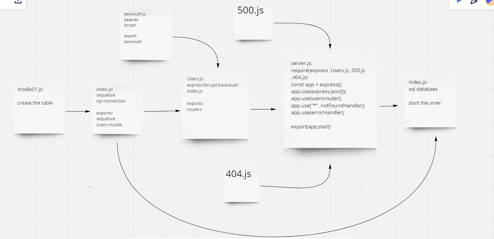

# basic-auth

this application is a server that works on authntication with sign in and sign up and its connected to database to save thr user name and password every time od sign up.

## UML

## linkes

https://saad-alzubi-authentication.herokuapp.com/

https://github.com/saadomaralzoubi/basic-auth/pull/1

https://github.com/saadomaralzoubi/basic-auth/actions
